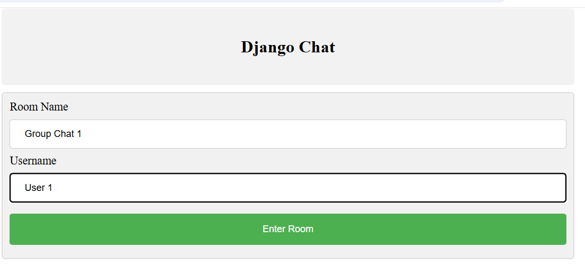
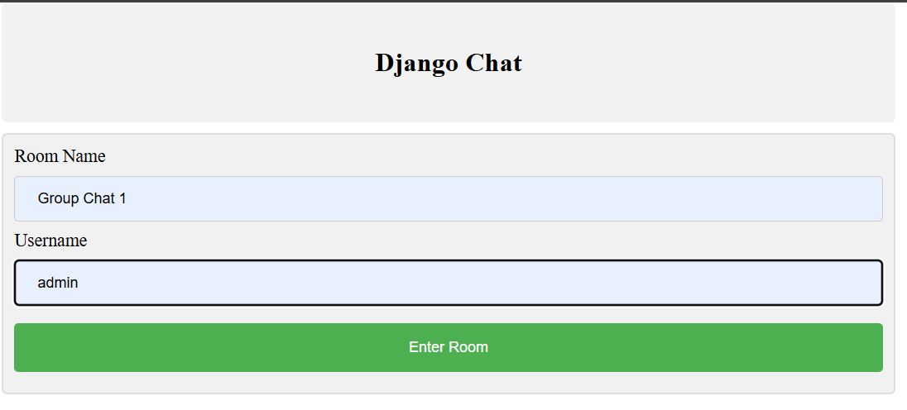
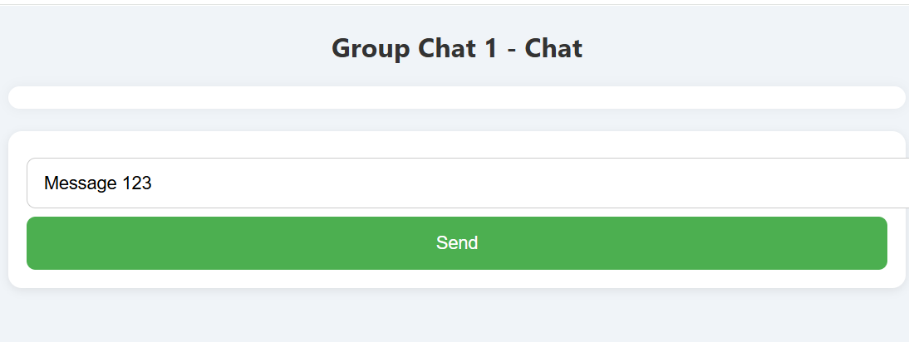
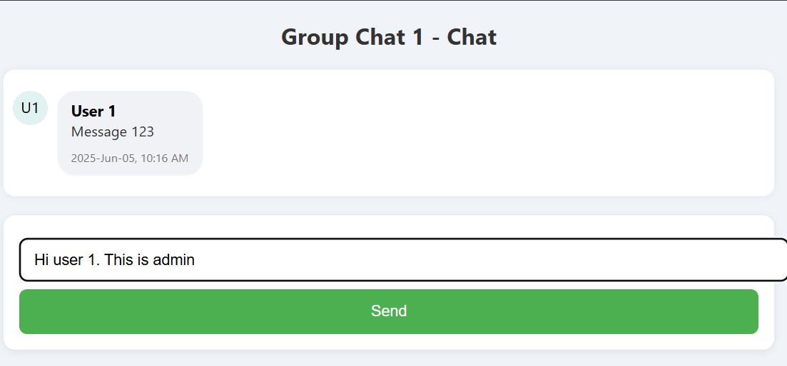
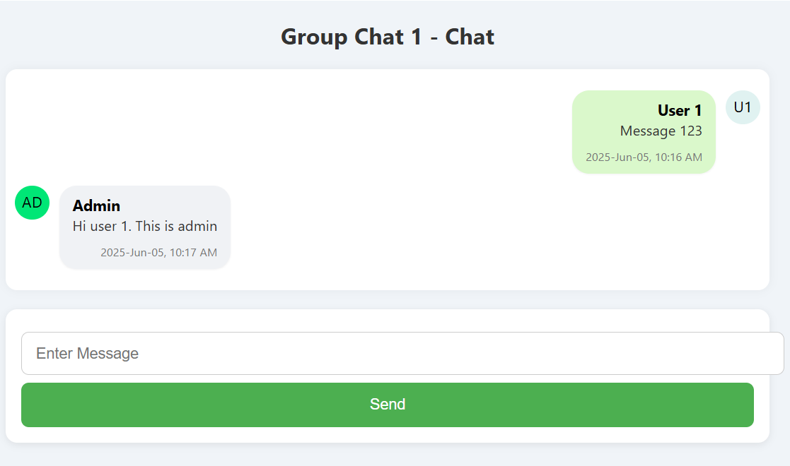

# django-chat-ajax
Django real time chat application with ajax

# 💬 Django Real-Time Chat Application (with AJAX)

This is a web-based real-time chat application built using **Django**, **AJAX**. It supports group chat functionality with live updates — no page reloads.

---

## 🚀 Features

- 🔐 User Registration & Login
- 💬 Real-Time Chat via AJAX
- 👥 Group Chat
- 🕒 Chat History with Timestamps
- 📦 SQLite 3

---


## 🛠️ Tech Stack

- **Backend**: Django (Python)
- **Frontend**: HTML, CSS, JavaScript, AJAX
- **Database**: SQLite3
- **Authentication**: Django's built-in auth system

---

## 📦 Installation & Setup

### 1. Clone the Repository

```bash
git clone https://github.com/<your-username>/django-chat-app.git
cd django-chat-app
```

### 2. Install Dependencies
```bash
pip install -r requirements.txt

```
### 3. Apply Migrations
```bash
python manage.py makemigrations
python manage.py migrate
```
### 4. Create Superuser (for admin access)
```bash
python manage.py createsuperuser
```
### 5. Run the Development Server
```bash
python manage.py runserver

```


## 🖼️ Screenshots

### 🔐 Login Page



### 🧑‍💻 Chat Room


### 📄 Chat History



---